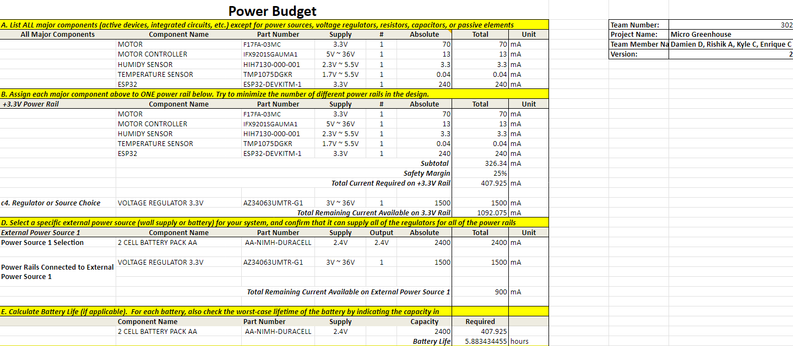

Motor (Kyle C)

| Component | Pro's | Cons |
|------|----------------------------|-----------------------------|
| SE10G0UTMAF | Simplistic data sheet. Torque charts show amperage per torque. Speed reaches almost about 11100 min with no load.| Component chassis is small. Shaft too small to operate around. Data sheet missing data such as operating temperature| 
| SE8G0NTMCA | Easy to mount (can be placed anywhere on the product). Gives details about how much power the motor can operate. No load speed at 12500 mins| Component chassis is small. Shaft too small to operate around. Data sheet too simplistic, showing only one version of the component and it’s data | 
| ***F17FA-03MC*** | ***Data sheet includes detailed specs on the fans operation. Requires little power to operate. No need for high voltage. Gives data about the static pressure vs airflow.***| ***Components have pre-made fan/chassis. Limited placement on product. Fan data sheet seems to be too simplistic. No information about reverse direction.***| 

Chosen Component: Option 3

Rational: Though the motor for the product is embedded within a fan and chassis, this meet’s the requirements of what the product wants to do. Though mounting is a bit limited, the specs allow us to operate the motor to the desired speed for its purpose. The only thing needed to test is the directional operation of the fan.

Motor Controller (Kyle C)

| Component | Pro's | Cons |
|------|----------------------------|-----------------------------|
| ***IFX9201SGAUMA1*** |  ***Reliable component (used in previous assignment). Includes over temp shutdown mechanic. Gives Simple understanding of what each pin does. Includes commands for motor operation.***| ***Register commands are complicated to understand without some sort of guidence. Surface mount prongs are small and compact to each other. Requires only certain prongs to be connected to operate properly.***| 
| DRV8876PWPR | Includes a proper chart of pins and what each pin does. Operation conditions are noted and shown for guidance. Includes logic for forward and reverse drive.Most cost effective component out of the 3| Component requires solder paste mounting. Temperature ranges are small for comfort. Pin connection requires further inspection | 
| A3950SLPTR-T | Includes typical application Diagrams. Showcases Load conditions with Oscilloscope images. Includes drive currents and equations for it.***|***Component requires solder paste mounting. Package has a low thermal resistance. Power voltage higher than necessary.| 

Chosen Component: Option 1

Rational: When choosing which component to use, option 1 is the most reasonable choice. The component is well known and used in previous assignments. Included with this component are example diagrams of how to connect the component to both the controller and the motors and what commands are needed for operating the motor.
 

Humidity Sensor (Enrique C)

| Component | Pro's | Cons |
|------|----------------------------|-----------------------------|
| ENS211-LQFM |This humidity sensor is extremely cheapDoes not require extra considerationsCheapest optionLow response time @ 3 secConsumes less voltage| Surface mount does not have pinsNo extra pins for alerts| 
| HIH6030-021-001 | Surface mounting pins No extra considerations requireMiddle priceHas two extra pins for alerts | Consumes more voltage than cheaper oneHas lower accuracy @ +- 4.5%Higher response time @ 6 sec | 
| ***HIH7130-000-001*** | ***Better accuracy @ +- 3% than the middle priced one Consumes less voltage than HIH6030Surface mount pinsHas two extra pins for alerts*** | ***Most expensive out of the threeHigher response time @ 6 sec***| 

Chosen Component: Option 3

Rational: For the price of less than 3 dollars I choose to purchase the ENS211 to verify if the soldering is achievable. If mounting the ENS211 is difficult I would like to be able to have a back up hence why i also choose the HIH7130. The PCB can be constructed having both the HIH7130 or ENS211 mounting ports. Since both are I2C i believe we can have both in the same PCB.

Temperature Sensor (Rishik A)

| Component | Pro's | Cons |
|------|----------------------------|-----------------------------|
| TS-3032-C7-QA |Cost-effective. I2C output .Within Voltage Operation Range (3.3V). Digital| Smallest temperature sensing range. More complex calibration is required for higher precision. More expensive than the average temp sensors.| 
| ***TMP1075DGKR*** | ***Within Voltage Operation Range (3.3V). Greatest Temperature sensing range. Digital. Uses a standard I2C protocol which makes integration with microcontrollers easier.***| ***Temperature readings may become slightly less precise at the extremes of its operational range. Cannot withstand harsh conditions like high humidity, dust or outdoor use.*** | 
| P3T1755DPZ | Extremely cost effective. Flexibility with output types (I2C, 2-Wire Serial). Surface mount. Very wide temperature operating range. Within Voltage Operation Range (3.3V). Digital| Very small in size.  Moderate accuracy. Lack of integrated features. Sensitive to power supply fluctuations.|  

Chosen Component: Option 2

Rational: As a requirement our sensors need to communicate with I2C, Option 2 stands out as a better choice compared to Options 1 and 3 due to its balance of high accuracy (±0.5°C), low power consumption, and ease of integration via the I2C interface. It offers a broad temperature range and compact size, making it ideal for battery or solar-powered applications like our micro-greenhouse project. Additionally, it's more cost-effective while providing reliable
performance, making it a practical choice over the more complex and potentially pricier alternatives

Battery (Damien D)

| Component | Pro's | Cons |
|------|----------------------------|-----------------------------|
| NH22NBP |Meets ideal power requirements. Rechargeable| Not cost effective. Low current production (175mAh). Not Scalable| 
| ***AA-NIMH-DURACELL*** | ***Rechargeable Scalable Voltage. Common to find in local stores. Very high current capacity ( 2500mAH). Cost effective***| ***Scaling is space intensive. Scaling requires increased complexity*** | 
| A1604 BK210J | Meets ideal power requirements. High current capacity (614mAh). Cost effective| Single use. Not Scalable| 

Chosen Component: Option 2

Our team is currently undergoing consideration and possible changes for power. We are considering potentially making our device rechargeable with solar power. So batteries which have this capability would allow us to make a switch if necessary. So while option 3 the A1604, is the most cost effective while in the ideal voltage range, it is eliminated as a potential choice. Leaving just options 1 and 2. Option 1 falls inside our ideal voltage range as well. However our device will have a motor and that motor is going to consume a lot of current, possibly enough to make option 1’s output of 175mAh problematic. Additionally it is the most expensive option. While option 2 is less voltage, it is cost effective enough to use multiple to get to 9V while still being reasonably close to option 1 ($28 vs $20), with the added benefit of way more current capacity, dramatically increasing the battery life. It is with these consideration, our team has chosen option two 

Voltage Regulator (Damien D)

| Component | Pro's | Cons |
|------|----------------------------|-----------------------------|
| TPS562201DDCR |Cost effective. Can handle high current if necessary (4A). Step down allows for use of higher voltage| Minimum input voltage is on higher end (4.5V)| 
| ***AZ34063UMTR-G1*** | ***Cost effective ($0.34). Dual step up, step down functionality. Large input voltage range (3V to 35V). Large current output (1.5A)***| ***Increased complexity*** | 
| AP3015KTR-G1 | Step down allows for use of lower voltage. Large output voltage range (1.25V-34V)| Very low output current. Not cost effective ($0.54 the most expensive)| 

Chosen Component: Option 2

There is a high chance our device will use a power source which is rated higher than the operating voltage of most of our components so out of the two step down options, option 2 gives us the best cost effectiveness and most flexibility, as the input and output voltage ranges are high while also having a solid current capacity.

Using a step up is a possible route as well which occurs with option 3 and 2. This would allow us to use a lower rated power supply thus potentially making our device simpler and cheaper. However the output current for option 3 is very low at 300mAh which runs the risk of our motor consuming too much of the available current. It is also the most expensive of all the options. 

Considering that option 2 gives us the ability to pursue both the step up and down route with superior specs all for less money, this makes option 2 the best selection for our design

