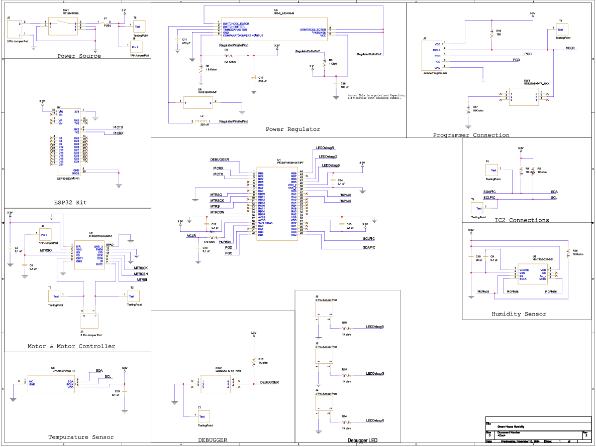

# Hardware Implementation

The Hardware implementation is a culmiation of the teams components on one singular board. The main goal of this product is to monitor both tempurature and humidity, based on the monitored variables, use a fan to adjust the tempurature. The Schematic is design to allow easy guidance, from the top right of it showing the power and regulator schematic's, to the subsystems other members designed.  to help guide what connected to what, the main board designer used net labels for a organized deisgn and easy to follow wire tracing. The schematics design was kept in the mind of the consumer in hopes for easy understanding and guidence for them.

