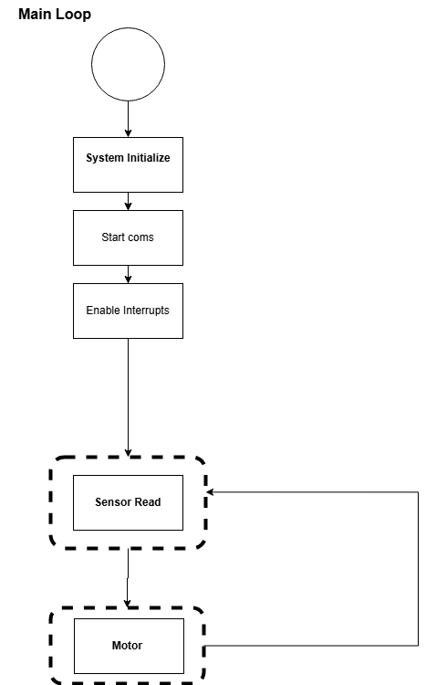

# Software Implementation
Our team's software offers a streamlined solution for users to monitor and control temperature based on their input for both temperature and humidity. The following sections provide detailed explanations of the code blocks, outlining their functionality and the logic behind each operation. 
## Main Loop
Below is the final diagram illustrating how our code interacts with the PCB. Each section of the diagram, outlined in bold font, represents a distinct block providing more details about its specific functionality.

Due to time constraints and issues with the PCB not functioning properly, we had to remove the debugging and low-power features from the final diagram. These features could not be implemented within the available timeframe.

The original design included a debugging block (located at the bottom of the diagram) to verify communication between the sensors, the H-bridge, and the MCU. Additionally, a low-power design was planned but could not be implemented due to challenges in understanding how to code it with our PCB setup.

## System Initialization Block
This block ensures the initialization of all peripherals used in the code, including UART, SPI, I2C, the system clock, and pins. It also verifies that all necessary header files are included in the main code.

## Sensor Read Block
This block activates either SPI or I2C to retrieve data from the temperature and humidity sensors via their respective peripherals. The data is then returned to the main code to determine whether the motor should be turned on or off.

## Motor Block
This block evaluates the temperature data to decide whether the motor should be activated or deactivated, ensuring it operates within the specified range.

## Debugging Block

