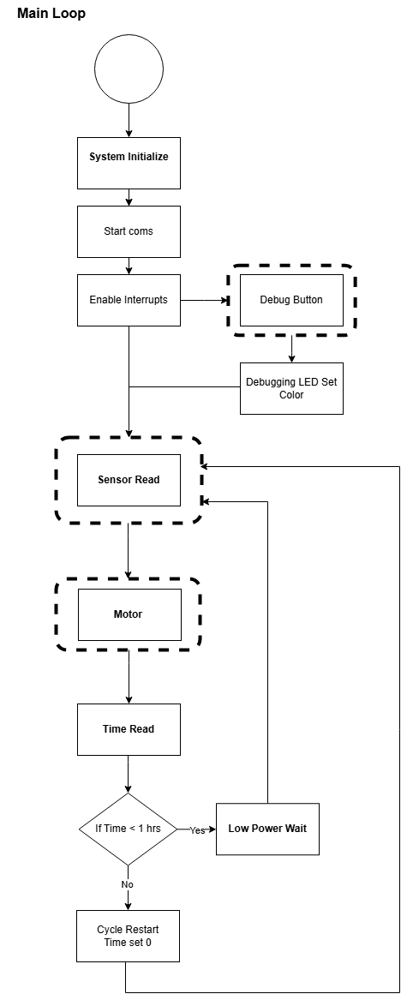
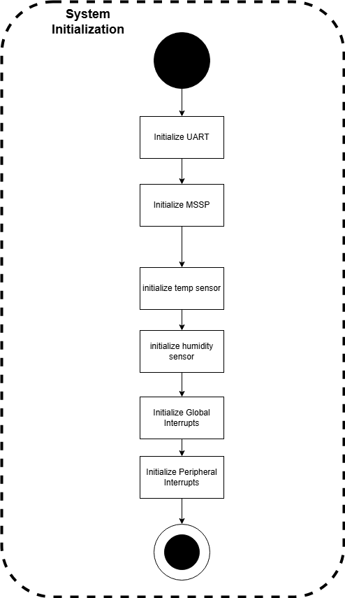
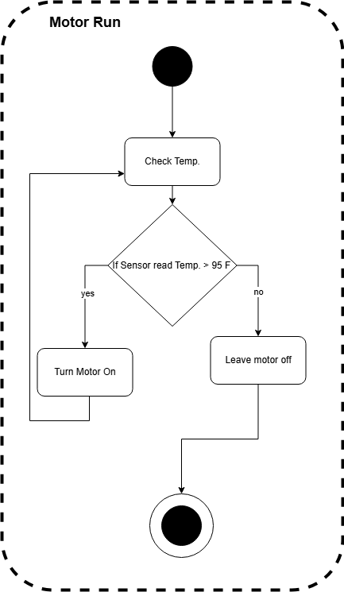

# Software Proposal
Our team's software offers a streamlined solution for users to monitor and control temperature based on their input for both temperature and humidity. The following sections provide detailed explanations of the code blocks, outlining their functionality and the logic behind each operation. 
## Main Loop

## System Initialization Block

## Debugging Block

## Sensor Data Read Block

## Motor Run Block

